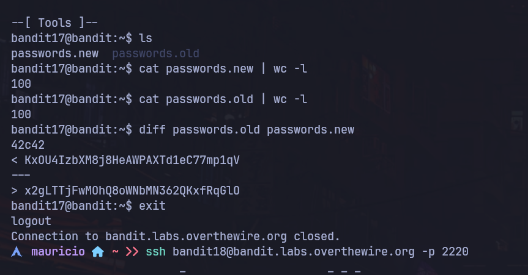

# Bandit Nivel 17 --> Nivel 18

## Objetivo 
Para el siguiente caso nos indica que existen 2 archivos en el home directory passwords.old y passwords.new. Nos dice que la contraseña para el siguiente nivel esta en el password.new y es la unica linea que ha sido cambiada entre el old y el new

## Comandos usados 
cat
grep
diff
wc -l

## Evidencia 

## Explicaciòn
Comensando a listar con ls verificamos que se encuentran estos 2 archivos en el home del bandit17 a lo que utilizaremos una herramienta que nos muetra la diferencia que tienen 2 archivos al mismo tiempo, permitiendonos a nosotros saber cuales son las 
lineas que se cambiaron o se modificaron dejandonos con la contraseña para el siguiente nivel. 
Comprobramos igualmente que al usar wc -l a ambos archivos nos muestra un total de 100 lineas cada 1 --> cat password.new | wc -l y cat password.old | wc -l
Usamos el siguiente comando : diff passwords.old passwords.new
Al ejecutarlo nos muestra la linea que se quito y mas abajo la linea que se aumento, la cual es la contraseña para bandit18 

Al ingresar al bandit18 por ssh verificamos que nos expulsa verificando el siguiente nivel nos indica que la contraseña para el bandit18 esta en una carpeta readme en el directorio pero desafortunadamente alguien ha modificado la .bashrc para que no podamos entrar
con SSH ** Ver siguiente nivel para explicaciòn **

## Contraseña para el siguiente nivel 
x2gLTTjFwMOhQ8oWNbMN362QKxfRqGlO
