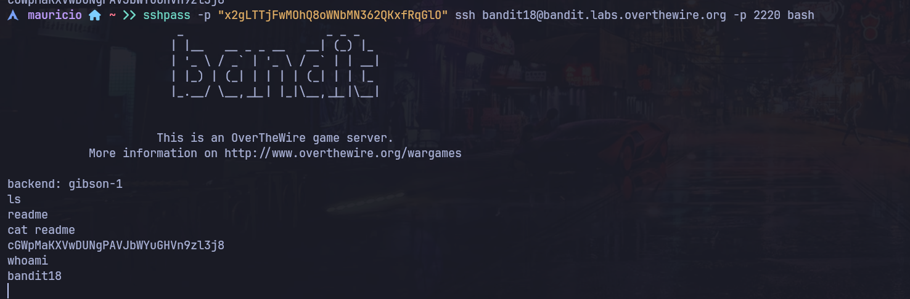

# Bandit Nivel 18 --> Nivel 19

## Objetivo 
Como nos quedamos en el ejericio anterior alguien modifico la .bashrc para no nos podamos loguear por SSH por lo que debemos de descubrir otra ruta para poder entrar u obtener una consola para el bandit18

## Comandos usados 
sshpass -p "contraseña del bandit18"

## Evidencia 

## Explicaciòn
Usamos sshpass ya que al usar normalmente ssh no podemos mandarle una pipeta o una concatenaciòn como en netcat para la contraseña por temas de seguridad, ya que ssh normal trabaja de forma estrictamente interactivo, sim embargo sshpass
esta diseñada especificamente para engañar a SSH. Crea una terminal interactiva falsa en segundo plano, intercepta el mensaje de password: que pide SSH, e inyecta automaticamente la contraseña que tu le pasaste con el flag -p.
Utilizaremos el siguiente comando en la terminal para poder obtener una respuesta positiva ya que si es la contraseña de bandit18 y le solicitaremos que nos lea el archivo readme de esa manera nos entregara la contraseña para el siguiente nivel.

sshpass -p "x2gLTTjFwMOhQ8oWNbMN362QKxfRqGlO" ssh bandit18@bandit.labs.overthewire.org -p 2220 cat readme 

Tambien opcional a esto podemos utilizar el mismo comando para que nos de una terminal bash con el usuario bandit18 de la siguiente manera : 

sshpass -p "x2gLTTjFwMOhQ8oWNbMN362QKxfRqGlO" ssh bandit18@bandit.labs.overthewire.org -p 2220 bash 

Veremos el cursos parpadeando por lo que si ponemos el comando ls + Enter 
Nos mostrara una carpeta llamada readme, si hacemos ahora un cat readme, nos brindara la contraseña igualmente del siguiente nivel. 

cGWpMaKXVwDUNgPAVJbWYuGHVn9zl3j8

## Contraseña para el siguiente nivel
 
cGWpMaKXVwDUNgPAVJbWYuGHVn9zl3j8
