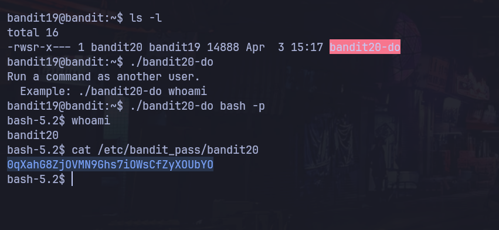

# Bandit Nivel 19 --> Nivel 20

## Objetivo 
Para este siguiente nivel, nos indica que debemos usar el setuid binario que esta en el home directory, Nos indica que la siguiente contraseña puede ser encontrada en el /etc/bandit_pass/. 

## Comandos usados 
ls
bash -p

## Evidencia 

## Explicaciòn
Al listar el archivo que existe el binario setuid con ls -l observamos que el archivo le pertenece al usaurio bandit20 pero en grupo pertenece al usuario19 por lo que podriamos tener una via potencial de gestionar ese archivo. 
Al ejecutar el binario ./bandit20-do nos sale un mensaje que indica que corramos el commando como otro usuario, si observamos lineas mas abajo vemos que nos dice un ejemplo : ./bandit20-do whoami, por lo que al parecer podemos introducir 
comandos al momento de correrlo por lo que aprovecharemos para crear una bash interativa como bandit20 o una sh, 
./bandit20-do bash -p 
./bandit20-do sh 
De igual manera nos entregara una terminal con la que podremos operar como bandit20, de esa manera entramos al /etc/bandit_pass/bandit20 para saber cual es la contraseña para el siguiente nivel 

## Contraseña para el siguiente nivel 
0qXahG8ZjOVMN9Ghs7iOWsCfZyXOUbYO
