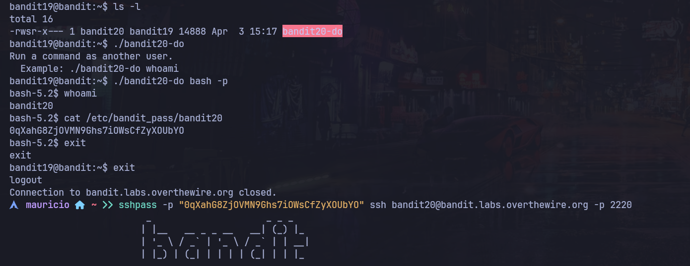

# Bandit Nivel 20 --> Nivel 21

## Objetivo 
Para el siguiente ejercicio nos dan un archivo con SETUID binario llamado suconnect, el cual entabla una conexion al localhost por el puerto que le demos como linea de argumento, y la comparara con la contraseña del nivel anterior y si es corercta nos entrega la nueva contraseña.

## Comandos usados 
nc -nlvp 

## Evidencia 

## Explicaciòn
De igual manera al hacer ls -l al archivo suconnect observamos que el usuario propietario es bandit21 y el gruipo es bandit20 por lo que tendriamos una via de leer y ejecutar el archivo por el r-x en los permisos.
Al intentar ejecutar el binario nos sale un mensaje diciendo que el programa se conectara a un puerto en el localhost usando TCP, Si recibe la contraseña correcta del usaurio bandit20, la proxima contraseña se transmitara como respuesta. 
Para este caso es necesario abrir una segunda terminal con la misma sesion de bandit20 para poder estar en escucha con netcat por un puerto y enviarl la contraseña:
Desde la 1era Terminal y dentro de bandit20: 
nc -nlvp 4848 
n : Para que no aplique resolucion DNS
l : Es para el listen mode
v : verbose para que si hay movimiento o algo paso nos lo muestre por consola
p : para el puerto  
Desde la 2da Terminal y dentro de bandit20: 
./suconnect 4848
Ocurre la magia, al parecer dentro de suconnect corre un servicio o programa donde si se conecta a un puerto en especifico espera una respuesta en este caso la contraseña del bandit20 la introducimos desde la 1era Terminal y nos devuelve la contraseña 
del bandit21 0qXahG8ZjOVMN9Ghs7iOWsCfZyXOUbYO y nos devuelve la contraseña del bandit21 EeoULMCra2q0dSkYj561DX7s1CpBuOBt

## Contraseña para el siguiente nivel 
EeoULMCra2q0dSkYj561DX7s1CpBuOBt
