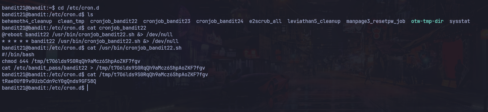

# Bandit Nivel 21 --> Nivel 22

## Objetivo 
Para el siguiente nivel nos indica que hay un programa corriendo automaticamente en intervalos regulares por cron. Nos dice que veamos el /etc/cron.d/ para ver la configuracion y ver que comandos han sido ejecutados.

## Comandos usados 
ls
cat 

## Evidencia 

## Explicaciòn
Las tareas cron son las que se ejecutan en el sistema a invervalos regulares de tiempo. 
Entramos al /etc/cron.d y con ls vemos varios archivos , pero nos enfocaremos en el cron para bandit22
Hacemos un cat al archivo dentro de /etc/cron.d llamado cronjob_bandit22.sh y vemos que los 5 primeros asteriscos significa que la tarea se va a ejecutar cada minuto, se leen de izquierda a derecha en el siguiente orden : 
Minuto(0-59) Hora(0-23) Dia-del-mes(1-31) Mes(1-12) Dia-de-la-semana(0-7)Donde 0 y 7 son domingo 
En caso de ver solamente * * * * * Significa que se ejecuta todos los minutos, de todas las horas, de todos los dias del mes y de la semana
En caso de ver solamente 0 * * * * Significa que se ejecuta a cada hora en punto, en el minuto 0
Vemos que esta ejecutando este Script /usr/bin/cronjob_bandit22.sh
cat /usr/bin/cronjob_bandit22.sh --> nos encontramos con lo siguiente.

#!/bin/bash
chmod 644 /tmp/t7O6lds9S0RqQh9aMcz6ShpAoZKF7fgv
cat /etc/bandit_pass/bandit22 > /tmp/t7O6lds9S0RqQh9aMcz6ShpAoZKF7fgv

Vemos que hace un chmod asignacion de permisos al /tmp//tmp/t7O6lds9S0RqQh9aMcz6ShpAoZKF7fgv

Tambien vemos que /etc/bandit_pass/bandit22 la contraseña de bandit22 la redirige a una ruta en /tmp/t7O6lds9S0RqQh9aMcz6ShpAoZKF7fgv 

Por lo que en conclusion sabemos que esa ruta en tmp tiene permisos 644 para grupo y que en esa ruta esta almacenada la contraseña del bandit22, como 644 grupos y otros pueden leer read rwx 421, podemos leer el archivo de tmo para obtener la contraseña:

cat /tmp/t7O6lds9S0RqQh9aMcz6ShpAoZKF7fgv

Lo que nos da la contraseña para el siguiente nivel 

## Contraseña para el siguiente nivel 

tRae0UfB9v0UzbCdn9cY0gQnds9GF58Q
