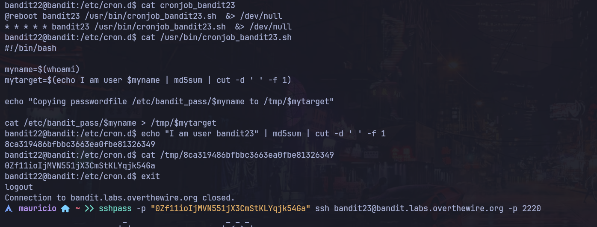

# Bandit Nivel 22 --> Nivel 23

## Objetivo 
El siguiente ejericio nos indica que hay un programa corriendo automaticamente en intervalos regulares desde cron. Nos indica que verifiquemos la ruta /etc/cron.d 

## Comandos usados 
ls 
cd 
cat 
echo 

## Evidencia

## Explicaciòn

Nos movemos al directororio /etc/cron.d y verificamos que hay un archivo llamado crojob_bandit23 al cual al hacerle cat podemos observar lo siguiente : 

@reboot bandit23 /usr/bin/cronjob_bandit23.sh  &> /dev/null
* * * * * bandit23 /usr/bin/cronjob_bandit23.sh  &> /dev/null

Por lo que la tarea cron nos indica que se esta ejecutando un archivo /usr/bin/cronjob_bandit23.sh a cada minuto * * * * *  por que lo que veremos que hay dentro del script para entender que tarea se esta ejecutando. 

cat /usr/bin/cronjob_bandit23.sh nos muestra lo siguiente 
#!/bin/bash

myname=$(whoami)
mytarget=$(echo I am user $myname | md5sum | cut -d ' ' -f 1)

echo "Copying passwordfile /etc/bandit_pass/$myname to /tmp/$mytarget"

cat /etc/bandit_pass/$myname > /tmp/$mytarget

Significa que es un archivo bash que esta encapsulando la variable myname =$(whoami) --> a nivel de sistema ejecuta un whoami a lo que si es bandit23 myname valdra bandit23
Vemos que tambien usa la variable mytarget=$(echo I am user $myname | md5sum | cut -d ' ' -f 1) --> Igualmente a nivel de sistema hace un echo "I am user bandit23" y lo transforma a md5sum generalmente usado para encriptar contraseñas o hashes. 
Si nosotros ejecutamos el mismo comando pero con el nombre que contiende myname que sabemos que es bandit23 nos sale lo siguiente : 

echo "I am user bandit23" | md5sum | cut -d ' ' -f 1 --> esto lo podemos hacer en nuestra terminal o en la misma sesion de bandit22 a lo que al darle ENTER nos sale el siguiente mensaje : 
8ca319486bfbbc3663ea0fbe81326349

Bien ahora que tenemos el hash que esta guardado dentro de mytarget observamos que esta copiando la contraseña de /etc/bandit_pass/bandit23 a /tmp/$mytarget como sabemos lo que significa mytarget iremos directamente a leer esa ruta absoluta : 
cat /tmp/8ca319486bfbbc3663ea0fbe81326349
A lo que nos sale la contraseña para el siguiente nivel --> 0Zf11ioIjMVN551jX3CmStKLYqjk54Ga

## Contraseña para el proximo nivel
0Zf11ioIjMVN551jX3CmStKLYqjk54Ga
