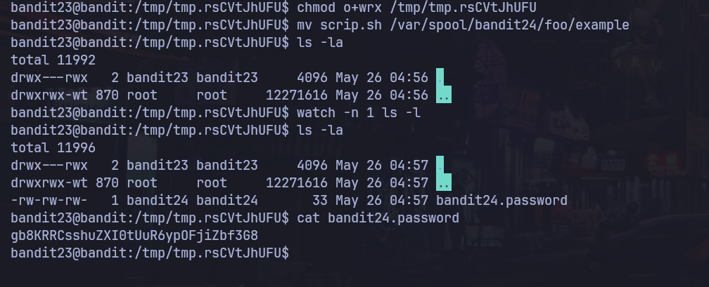

# Bandit Nivel 23 --> Nivel 24

## Objetivo 
Pues lo mismo para este siguiente nivel tambien existe una tarea cron que ya entendimos que son. Verificar en /etc/cron.d nos dan tambien 2 notas: 
NOTA : Este nivel requiere que crees tu propio shell-script - Este es un gran paso and deberias sentirte orgulloso cuando logres este nivel 
NOTA2: Manten en mente que tu script shell sera removido una vez sea ejucutado, por que lo que podrias querer una copia cerca. 

## Comandos usados 
ls -l
cat 
nano
mv 
cp
mktemp -d
cd 
#!/bin/bash
chmod 
watch -n 1 ls -l

## Evidencia 

## Explicaciòn
Entramos una vez mas a /etc/cron.d y vemos que al usar cat al cronjob_bandit24 aparece lo siguiente: 
@reboot bandit24 /usr/bin/cronjob_bandit24.sh &> /dev/null
* * * * * bandit24 /usr/bin/cronjob_bandit24.sh &> /dev/null

el @reboot --> Significa que en cada reinicio se esta ejecutando esta tarea cron  vemos que se ejecuta lo siguiente /usr/bin/cronjob_bandit24.sh a cada minuto vemos que hay dentro : 

cat /usr/bin/cronjob_bandit24.sh
#!/bin/bash

shopt -s nullglob

myname=$(whoami)

cd /var/spool/"$myname"/foo || exit 
echo "Executing and deleting all scripts in /var/spool/$myname/foo:"
for i in * .*;
do
    if [ "$i" != "." ] && [ "$i" != ".." ];
    then
        echo "Handling $i"
        owner="$(stat --format "%U" "./$i")"
        if [ "${owner}" = "bandit23" ] && [ -f "$i" ]; then
            timeout -s 9 60 "./$i"
        fi
        rm -rf "./$i"
    fi

Vemos otro script en bash la primera parte shopt -s nullglob --> cambia la manera en que Bash interpreta los patrones glob (*, ?.txt, etc.).
Si no existe ninguna coincidencia, el patrón se expande a vacío en lugar de quedarse como texto literal.

Una vez mas encapsula en myname --> bandit24 
Se mete en /var/spool/bandit24 y vemos que no tenemos permisos para listar los archivos pero si nos vamos al directorio anterior osea solo /var/spool y ejecutamos ls -l podemos ver el directorio bandit24 que tiene root : bnadit24 y que otros pueden wx escribir y ejecutar. 
A lo que si podemos entrar al directorio y crear archivos pero no listar, utilizaremos esto pronto 
El script tambien nos dice : Ejecutando y borrando todos los scripts en /var/spool/bandit24/foo
Basicamente borrara todo lo que hay dentro excepto . y .. que son el directorio actual y el anterio como un cd ..
Seguidamente indica que capturara el propietario de los archivos que entan dentro, por lo que si nosotros creamos un archivo o un script dentro el propietario seriamos nosotros bandit23
stat --format "%U" "./$i --> este comando si se lo pasas a un archivo cualquiera solamente se quedara con el nombre del propietario que lo creo, entonces a continuacion dice que si owner es igual a bandit23 osea que si...
timeout -s 9 60 "./$i" --> En un tiempo de 60 segundos ejecutara el archivo por lo que podria usar este script para que se lea la contraseña del /etc/bandit_pass/bandit24. Despues de este tiempo se borraran todos los archivos que estan dentro por lo que nos vamos a un lugar seguro
mktemp -d --> crea una carpeta dentro del sistema a la cual tienes acceso y puedes crear scripts a tu gusto te dara una ruta a la que tendras que moverte y creamos un archivo llamado scrip.sh
Le damos permisos de ejecuciòn chmod +x al script.sh para que todos puedan ejecutarlo cuando lo pasemos a la ruta donde se hara el proceso del cron, y tambien dar permisos a otros para la ruta que creamos chmod o+wrx /tmp/"segun lo que se creo en tu terminal"
#!/bin/bash

cat /etc/bandit_pass/bandit24 > /tmp/tmp.rsCVtJhUFU/bandit24_password
chmod o+r /tmp/tmp.rsCVtJhUFU/bandit24_password 

Introducimos esto dentro de nuestro scrip.sh y con mv lo mandamos a /var/spool/bandit24/foo/example
mv scrip.sh /var/spool/bandit24/foo/example 
Podemos usar watch -n 1 ls -l para ver en tiempo real que es lo que pasa en el directorio, despues de unos segundos llega el archivo llamado bandit24_password el cual contiene la contraseña para el proximo nivel. 
gb8KRRCsshuZXI0tUuR6ypOFjiZbf3G8

## Contraseña para el siguiente nivel 
gb8KRRCsshuZXI0tUuR6ypOFjiZbf3G8
